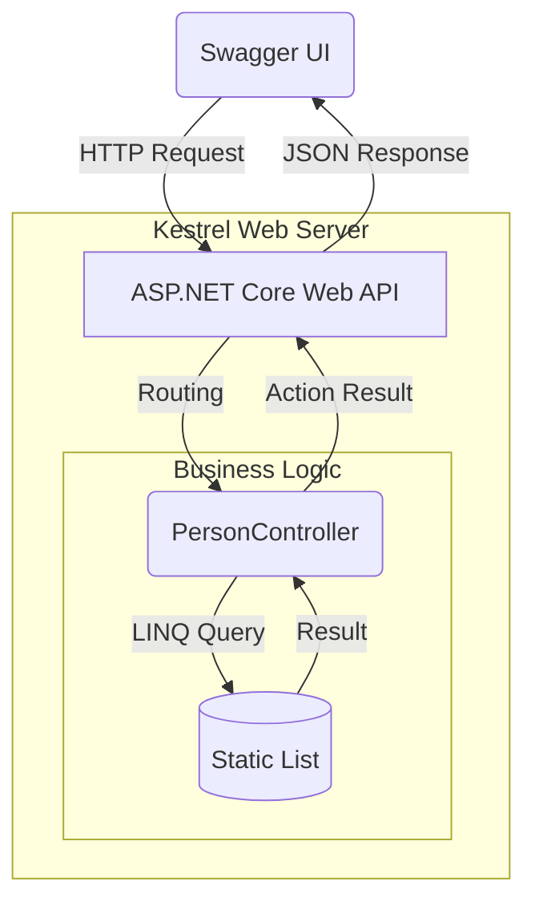

# C# and .NET
**Repository:** `khang-learn-csharp`

Dự án này là tổng hợp các kịch bản thực hành nền tảng về ngôn ngữ C# (strongly-typed, multi-paradigm OOP) và một RESTful API hoàn chỉnh sử dụng ASP.NET Core (Controller-based). Toàn bộ mã nguồn áp dụng các tính năng hiện đại nhất của C# như `record`, Pattern Matching, `async/await` và LINQ để thao tác với dữ liệu.

---

## Table of Contents
1. [Prerequisites](#prerequisites)
2. [Setup Guide](#setup-guide)
3. [Phần 1: Practice core features](#phần-1-practice-core-features)
4. [Phần 2: Web API](#phần-2-web-api)
5. [Testing Guide](#testing-guide)

---

## Prerequisites
- **.NET SDK**: Phiên bản `10.x` trở lên (Xác minh bằng lệnh `dotnet --version`).
- **Terminal**: Command Prompt (CMD), PowerShell, hoặc Git Bash.

---

## Setup Guide

1. Clone repository này về máy tính:
   ```bash
   git clone <url-github>
   cd khang-learn-csharp
   ```

2. Restore các packages và build project (Optional):
   ```bash
   dotnet build
   ```
   
## Phần 1: Practice core features

### Bài 1: OOP Basics (`01_OopPractice`)

- **Mục đích:** Khai thác tính đóng gói(Encapsulation), kế thừa(Inheritance) và đa hình(Polymorphism) trong C#. Thực hành xây dựng cây kế thừa từ lớp trừu tượng (abstract) hoặc Interface `Shape` xuống các lớp cụ thể như `Circle`, `Rectangle`, qua đó hiểu rõ cách CLR quản lý class (Reference type) trên bộ nhớ Heap.
- **Lệnh chạy:**
  ```bash
  dotnet run --project 01_OopPractice
  ```

### Bài 2: Generics & Collections (`02_GenericsCollections`)

- **Mục đích:** Nắm vững cách sử dụng các cấu trúc dữ liệu an toàn kiểu (type-safe) thông qua Generics. Thực hành thao tác thêm, sửa, xóa, duyệt trên `List<T>` và cấu trúc key-value với `Dictionary<TKey, TValue>`.
- **Lệnh chạy:**
  ```bash
  dotnet run --project 02_GenericsCollections
  ```

### Bài 3: LINQ (03_LinqPractice)

- **Mục đích:** Xử lý danh sách `List<Person>` bằng chuỗi truy vấn LINQ (Query Chain). Chứng minh cơ chế "Thực thi trì hoãn" (Deferred Execution) và thực hành đối chiếu các khái niệm quen thuộc: filter (`Where`), map (`Select`), sắp xếp (`OrderBy`), và tính toán cộng dồn (`Aggregate`).
- **Lệnh chạy:**
  ```bash
  dotnet run --project 03_LinqPractice
  ```

### Bài 4: Async I/O with Task (`04_AsyncPractice`)

- **Mục đích:** Phân biệt rõ `Task` (không trả về kết quả) và `Task<T>` (trả về kết quả kiểu T). Sử dụng từ khóa `async/await` để đọc file từ ổ cứng và gọi HTTP Call qua mạng dùng `HttpClient` mà không làm block thread chính (giải phóng Thread Pool cho các tác vụ khác).
- **Lệnh chạy:**
  ```bash
  dotnet run --project 04_AsyncPractice
  ```

### Bài 5: Records & Pattern Matching (`05_RecordsPractice`)

- **Mục đích:** So sánh Class thông thường với Record. Ứng dụng Record để tạo các DTO (Data Transfer Object) an toàn nhờ tính bất biến (Immutability), sao chép không phá hủy (Non-destructive mutation bằng từ khóa with), và thay thế chuỗi if-else phức tạp bằng switch expression (Pattern Matching).
- **Lệnh chạy**
  ```bash
  dotnet run --project 05_RecordsPractice
  ```

---

## Phần 2: Web API

Một Web API Server xây dựng bằng kiến trúc ASP.NET Core Controllers, quản lý thông tin nhân sự với dữ liệu lưu trữ tạm thời trên RAM (`In-memory List<T>`)

### Architecture Diagram



### Khởi động Server

Bắt buộc khởi động Server trước khi tiến hành test API, Ứng dụng đã được cấu hình cứng để chạy trên cổng 5000:
```bash
dotnet run --project WebApi
```
*Server sẽ bắt đầu lắng nghe (Listen) tại: `http://localhost:5000`*

### API Endpoints Reference

| HTTP Method | Endpoint | Mô tả | Body (JSON Format) |
| :--- | :--- | :--- | :--- |
| **GET** | `/api/person` | Lấy toàn bộ danh sách nhân sự | Không |
| **GET** | `/api/person/{id}` | Lấy chi tiết nhân sự theo ID | Không |
| **POST** | `/api/person` | Thêm nhân sự mới | `{ "id": 5, "name": "Khang", "role": "Intern" }` |
| **PUT** | `/api/person/{id}` | Cập nhật thông tin nhân sự | `{ "id": 5, "name": "Khang", "role": "Dev" }` |
| **DELETE**| `/api/person/{id}` | Xóa nhân sự theo ID | Không |

---

## Testing Guide

### Test qua Swagger UI

Dự án đã tích hợp sẵn công cụ tự động sinh tài liệu OpenAPI (Swagger). Mở trình duyệt và truy cập:
```bash
http://localhost:5000/swagger
```

---